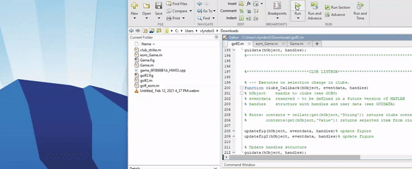

# MATLAB Golf Game

## Description
This application is a MATLAB GUI golf game. Players are presented with two golf green plots, a bird's-eye and horizontal view. The user may select a club, swing angle, and swing power. When the user clicks the "Swing" button the ball's trajectory is plotted. See if you can get a hole-in-one!

## Table of Contents
* [Links](#links)
* [Animation](#animation) 
* [Instructions](#instructions)   
* [Technologies](#technologies)  
* [License](#license)
* [Contact](#contact)

## Links

Repository: [https://github.com/spencercreer/golf_game](https://github.com/spencercreer/golf_game)

## Animation
The following animation demonstrates the application functionality:
 

## Instructions
This application must be run in MATLAB. Download all four files and run them in MATLAB

## Contribute
Please submit a PR if you would like to contribute.

## Technologies
 * MATLAB

## License
This project is licensed under the MIT license.

## Contact
For questions or comments, please contact me.

Email: <a href="mailto: spencercreer@gmail.com" target="_blank">spencercreer@gmail.com</a>

GitHub: [spencercreer](https://github.com/spencercreer/)
